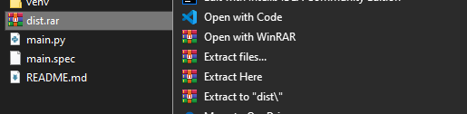
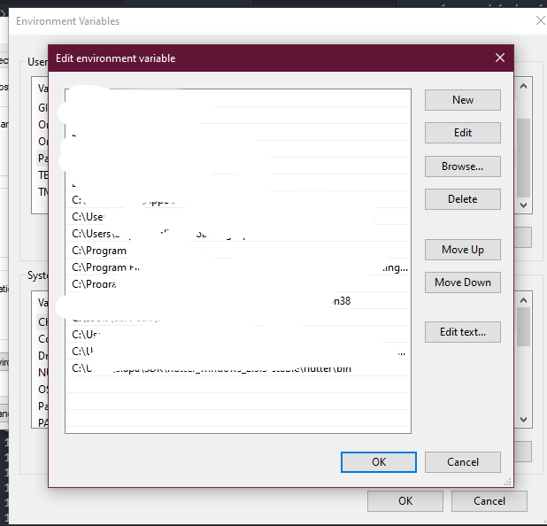
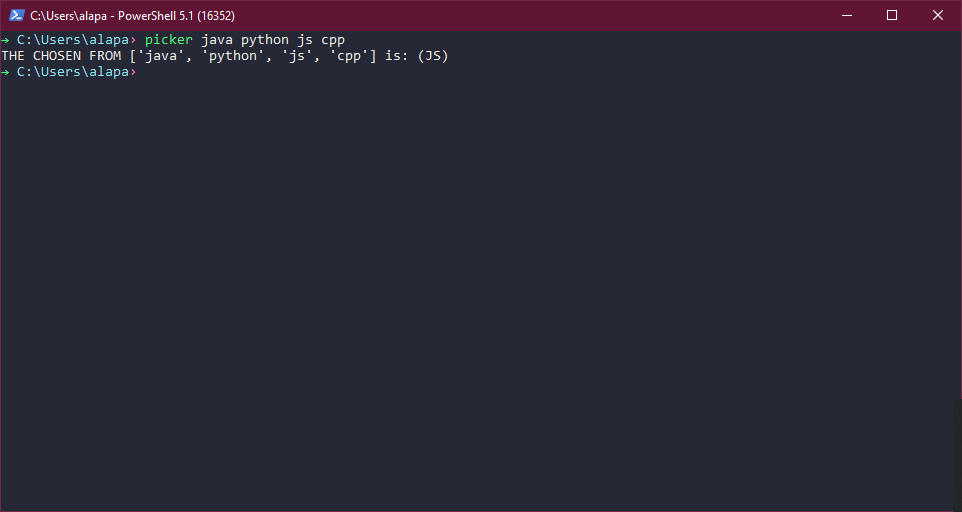

# RANDOM PICKER
## Description
Can't  pick about something? Let this random picker do the decision for you. Simply open your commandline/terminal and call this little script to make that hard decision for you. 

## How to install
1. Download the latest Release.

2. Extract the contents of the ZIP file.

***OPTIONAL***
3. Add the **dist** folder to the PATH env variable.

## How to use
Open your terminal/commandline call the script by:
> `./path/to/randompicker/dist/picker/picker.exe your_options goes here`

***if you added it to the PATH***
> `picker your_options goes here`

